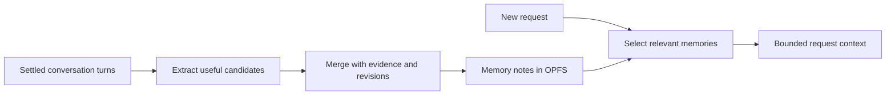

# Agent memory design review

Recommendation: evolve the useful parts of `feature/memory` into small, selective file-based memory backed by OPFS. Reuse the existing generic file tools. Keep readable notes and targeted edits; add reliable persistence, evidence, bounded retrieval, and incremental learning. Use OKF for the document format. Make memory quality and total task cost the measures of success.

Reviewed on 2026-09-19 against Wingman `main` at `a4a7cff1`, `feature/memory` at `9228c9b2`, and the local Codex checkout at `78245b47af`. This review records the baseline and design rationale. The resulting implementation on `feature/mem`, including the agreed controls and exact bounds, is described in [Agent memory](memory.md). The performance recommendations below are hypotheses to evaluate, not measured model improvements.

**The reviewed baseline.** The provider on `main` at `a4a7cff1` loads one `agents/{id}/MEMORY.md`, includes its entire contents in request context, and exposes `write_memory` to replace it. The tool enforces a 25 KiB write limit; the prompt asks for roughly 12 KiB / 200 lines. There is no relevance selection, structured evidence, revision check, or automatic consolidation.

This creates two costs: unrelated memories occupy context, and a small addition requires regenerating the whole document. A whole-file rewrite can also drop unrelated facts. Token cost depends on the model and cache behavior; byte counts are not token counts.

There are foundations worth retaining. [Request context](../src/shared/lib/requestContext.ts) is captured once per agent run, keeping tool-loop requests stable. [Chat compaction](../src/features/chat/lib/chatHistory.ts) preserves original visible messages in storage while reducing the model's active window. Those messages can support memory extraction without creating a second full transcript archive. [Persistence on main](persistence.md) already provides cross-tab locks, retryable queues, and failure recovery.

**The branch has good ideas.** Its memory changes introduce topic notes, a generated index, targeted text replacement, a batched `memory` tool, cached reads, secret redaction, migration, and an editor. It already describes its bundle as OKF v0.1. The intended limits are a 6 KiB injected index and 4 KiB per model-written note. These are substantial improvements over whole-document replacement.

The changes need further work before adoption:

| Finding                                                                                                     | Consequence                                                                                                               | Recommended change                                                                                                                                                                   |
| ----------------------------------------------------------------------------------------------------------- | ------------------------------------------------------------------------------------------------------------------------- | ------------------------------------------------------------------------------------------------------------------------------------------------------------------------------------ |
| The prompt treats merely naming a project, tool, or person as sufficient reason to save.                    | Low-value notes and maintenance accumulate.                                                                               | Retain information only when it should improve future behavior: explicit preferences, adopted decisions, corrections, or verified reusable lessons. A no-op is a successful outcome. |
| The injected index is ordered by last write; search returns the first matching regex lines in path order.   | Frequently edited or alphabetically early notes can crowd out useful ones.                                                | Rank by task relevance after scope/lifecycle filtering. Use recency as supporting evidence, not the primary ordering.                                                                |
| The parser splits YAML into individual `key: value` lines.                                                  | Nested `sources`, `generated`, and `verified` lose structure; source fields can become unrelated top-level fields.        | Use a real YAML parser and preserve unknown structured metadata.                                                                                                                     |
| Paths are flat filenames and listing is nonrecursive.                                                       | Hierarchical external bundles cannot be consumed directly.                                                                | Support safe relative paths for interoperability, or describe the current feature explicitly as a restricted producer.                                                               |
| The context truncator always retains the first line and adds its notice outside the budget.                 | The advertised context cap is not a hard cap.                                                                             | Budget the final rendered block, including metadata and truncation notices. Bound aggregate tool results too.                                                                        |
| Size checks and redaction live in the model tool, while UI edits and migration write directly to the store. | Store contents and later reads can exceed the tool's assumptions.                                                         | Enforce invariants at the storage boundary; explicitly handle oversized legacy/imported notes without silently discarding them.                                                      |
| Mutation serialization and caches belong to one JavaScript store instance.                                  | Two tabs can maintain different snapshots and overwrite the derived index. Full rewrites can also overwrite a newer edit. | Reuse main's persistence locks, invalidate caches across tabs, and check revisions inside the write transaction.                                                                     |
| Migration deletes the legacy file before its index/log work completes.                                      | A reported failure can leave a partially migrated bundle with no original file.                                           | Stage and validate migration, preserve original bytes until successful commit, and make recovery idempotent.                                                                         |

These findings refer to `feature/memory:src/features/agent/{lib/memoryContext.ts,lib/memoryParser.ts,lib/memoryStore.ts,lib/memoryTools.ts,prompts/memory.txt}` and `src/shared/lib/opfs-memory.ts` on that branch. Read the exact versions with `git show 9228c9b2:<path>`.

Another integration point matters: [tool assembly](../src/features/chat/hooks/useChatContext.ts) passes the parent's memory tools into [subagents](../src/features/tools/lib/subagent.ts). With the present interface, children can mutate shared memory. Give children selected context and read access; let the root or memory worker commit durable changes. This also reduces concurrent rewriting and accidental retention of delegated instructions as user preferences.

**What other systems contribute.** These are architectural comparisons, not claims that one system has been benchmarked as superior for Wingman.

| System                                                              | Observed approach                                                                                                                                                                                        | Useful lesson for Wingman                                                                                                                                 |
| ------------------------------------------------------------------- | -------------------------------------------------------------------------------------------------------------------------------------------------------------------------------------------------------- | --------------------------------------------------------------------------------------------------------------------------------------------------------- |
| Codex, local checkout                                               | Background per-conversation extraction followed by consolidation; bounded summary injection and supporting evidence on demand.                                                                           | Separate learning from answering, preserve evidence, and avoid processing unchanged inputs.                                                               |
| [Claude Code](https://code.claude.com/docs/en/memory)               | A bounded `MEMORY.md` entry point with separate topic files read on demand; project instructions remain a separate surface.                                                                              | Keep the entry point small and keep authoritative instructions distinct from learned context.                                                             |
| [Letta's current SDK](https://docs.letta.com/agent-sdk/memory)      | Git-backed MemFS, always-in-context `system/` files, other files read on demand, and optional background “dreaming.”                                                                                     | Separate small core memory from details and schedule maintenance outside active work. A new runtime is unnecessary for Wingman's first iteration.         |
| [Mem0](https://docs.mem0.ai/core-concepts/memory-operations/search) | Scoped semantic retrieval with filters, limits, and optional reranking. Its [current add documentation](https://docs.mem0.ai/core-concepts/memory-operations/add) describes additive extraction/storage. | Scope and relevance matter. Consider semantic retrieval when measured paraphrase failures justify it; define correction and deletion behavior explicitly. |

In the inspected Codex source, [startup orchestration](../../scratch/codex/codex-rs/memories/write/src/start.rs) runs extraction and consolidation asynchronously, skips ephemeral and non-root sessions, and checks remaining quota. [Consolidation](../../scratch/codex/codex-rs/memories/write/src/phase2.rs) can skip model work when inputs have not changed. This is more machinery than Wingman initially needs, but the separation is valuable. [Official OpenAI documentation](https://learn.chatgpt.com/docs/customization/memories) also distinguishes using existing memories from contributing new ones.

Be precise about Codex versions: [v1 is the default in this checkout](../../scratch/codex/codex-rs/config/src/types.rs). It uses a summary, searchable registry, rollout summaries, and optional reusable skills. The [v2 read prompt](../../scratch/codex/codex-rs/ext/memories/templates/memories/read_path_v2.md) encourages using sufficiently informative summaries directly and retrieving evidence only when it could change the answer. Both versions' injected summaries are [bounded at 2,500 tokens](../../scratch/codex/codex-rs/ext/memories/src/lib.rs). These source settings do not establish which version is enabled in a particular deployed session.

The strongest policy to borrow is in [Codex's extraction prompt](../../scratch/codex/codex-rs/memories/write/templates/memories/stage_one_system.md): prefer no output over low-value memory. The [v2 extraction policy](../../scratch/codex/codex-rs/memories/write/templates/memories/stage_one_system_v2.md) also distinguishes user statements from assistant proposals and preserves the scope of one-task instructions. For example, “show a plan before editing this” should not become a universal preference to seek approval before every edit.

**Where OKF fits.** The [linked specification](https://raw.githubusercontent.com/GoogleCloudPlatform/knowledge-catalog/refs/heads/main/okf/SPEC.md) is now v0.2; the [Google article](https://cloud.google.com/blog/products/data-analytics/how-the-open-knowledge-format-can-improve-data-sharing) introduces v0.1. The current format provides Markdown concepts, YAML metadata, links, optional indexes, provenance, verification, lifecycle, and staleness. It leaves storage and query infrastructure open.

Adopt that representation for Wingman's durable notes and exchange format. Wingman still needs its own capture, retrieval, conflict-resolution, and scheduling rules. Treat imported verification metadata as a claim whose origin must be established. It cannot grant tool permissions. Pin a supported format version and retain unknown fields when editing imported content. Attested computations can remain an optional future knowledge-catalog feature. Their execution is unnecessary for conversational memory.

**Proposed behavior.** A future agent should receive the smallest set of memories that changes how it should handle the current task. It should be able to recover supporting detail when needed.

Dedicated model-facing memory tools are optional. The current [shared file-tool factory](../src/shared/lib/file-tools.ts) already provides read, grep, glob, create, edit, delete, and move over a pluggable `WritableFileSource`. Prefer exposing an agent's memory through these existing operations. The selected mount is `/.memory/`, routing to `agents/{agentId}/memory/` in OPFS, while ordinary artifact paths retain their conversation storage. The [artifact filesystem](../src/features/artifacts/lib/fs.ts) remains scoped by `chatId`; the new memory adapter routes this mount separately.

```text
/.memory/index.md             -> agents/{agentId}/memory/index.md
/.memory/preferences.md       -> agents/{agentId}/memory/preferences.md
/.memory/projects/wingman.md   -> agents/{agentId}/memory/projects/wingman.md
```

The dot-directory marks persistent agent context and keeps the virtual root tidy. Existing path normalization accepts `.memory` as a directory segment. Hiding still requires an explicit mount policy: omit memory from ordinary artifact browsing, exports, and unscoped workspace searches; allow file tools to read or search it when explicitly scoped to `/.memory/`. Tell the agent about this mount in its memory instructions so discoverability does not depend on root listings. Reserve the path when memory is unavailable too, returning an unavailable result instead of silently writing a conversation artifact there.

The adapter must preserve memory's ownership, bounds, validation, revisions, and deletion semantics. Memory files should not automatically become chat deliverables, appear in artifact exports, or be deleted with a conversation. File tools must also be available when memory is enabled independently of artifact/code-execution features. Initially reject moves or atomic edit batches spanning storage mounts unless a coordinator can guarantee their semantics. Reuse the existing file operation schemas; avoid creating a second family of tools merely to give memory different operation names.

Storage validation, index refresh, context selection, and background learning remain application responsibilities behind the file interface. Plain filesystem operations can implement remembering and forgetting; a semantic recall tool is only worth adding if it provides capabilities that the shared interface and automatic retrieval cannot efficiently supply.



Use three levels, with distinct retention rules:

| Level               | Content                                                                                                    | How it reaches the agent                                                        |
| ------------------- | ---------------------------------------------------------------------------------------------------------- | ------------------------------------------------------------------------------- |
| Small core          | Explicit reusable preferences and a few stable constraints.                                                | Included directly; no tool call needed to rediscover a common preference.       |
| Durable topic notes | Adopted decisions, relevant project knowledge, corrections, and proven procedures, with source references. | Selected locally for the current task; search/read tools expose further detail. |
| Supporting history  | Source messages and, when useful, compact summaries of significant prior work.                             | Retrieved only when chronology, evidence, or uncertainty matters.               |

Current-task progress stays in conversation state. Required behavior stays in agent instructions. Broad reference material belongs in the repository/knowledge surface; memories can point to it. A reusable workflow can become a skill after it proves useful.

Start with agent-local ownership. Add project/topic applicability to notes when supported by the conversation, without inventing a project-management subsystem. Sharing personal defaults across agents should be deliberate. A project-specific preference must not silently become a global user preference.

For each note, retain its concept content plus references to existing conversations or messages, scope, last meaningful change, lifecycle, and a storage revision. Source tracking belongs inside memory rather than adding a field to general tool context. Keep retrieval statistics in a rebuildable sidecar rather than rewriting the note on every read. Use actual verification events; a model-generated confidence number is insufficient evidence. Stable paths or IDs should survive title changes and resolve to the source message in the UI.

**Read path.** Run local retrieval once when constructing a new user turn. Filter by ownership, applicability, deletion, and lifecycle first. Rank title/description/tags/body matches using a simple lexical index; give exact names and identifiers appropriate weight. Return no results when evidence of relevance is weak. Keep expired information available for historical questions while excluding it from current-fact injection.

The implementation uses a 1 KiB core allowance inside a hard 4 KiB UTF-8 bound for the complete automatic context, rather than claiming an exact tokenizer-dependent budget. These defaults are not measured optimal values. Account for the actual model tokenizer or a conservative fallback; a byte-to-token ratio is not a guarantee. Independently cap each search/read response and the total response to a batched tool call.

Keep the generated index for navigation and export, but do not inject every title on every request as the corpus grows. Reuse file read/grep/glob for explicit exploration, with memory-appropriate output bounds. Automatic selection can supply ranked snippets without a dedicated model-facing search tool. Read expands a specific result. Reuse the per-run context snapshot so memory changes do not rebuild the tool-loop prefix. Explicit forget/correction must suppress affected data in subsequent runs immediately.

Begin without an embedding request on the answer path. If cross-language or paraphrase cases fail, evaluate a hybrid lexical/semantic index using Wingman's existing embedding facilities. Embeddings would be derived retrieval data; source notes still own the truth. Measure added request latency and embedding cost before enabling this by default.

**Write path.** Explicit remember, correction, and forget requests use a small validated operation that commits before success is acknowledged. Other learning runs after settled turns, when the app is idle, and only over new or changed source material. An extractor may produce zero candidates. It should preserve adopted decisions and useful verified lessons, while keeping proposals, failures, uncertainty, and one-task instructions accurately labeled.

Consolidate only affected topics. Match candidates to existing notes, update or supersede contradictory claims, merge duplicates, and preserve independent supporting sources. Avoid rereading every chat or rewriting every note. Persist processing checkpoints and queued work, resume after app reopening, deduplicate by source version, and bound both model calls and tokens. Background work still costs tokens even when it does not delay the reply. A browser worker cannot promise to keep processing after the application closes.

Deletion needs durable suppression information so a later extraction does not regenerate a forgotten fact from retained conversations. Remove it from notes, cached context, indexes, pending candidates, and derived summaries. Keep the source chat under the chat retention policy unless the user separately deletes it. Edits to source messages should invalidate or re-evaluate dependent claims; deleted sources must not remain the sole evidence for a current claim.

Use the current persistence service for mutations. Enforce revision checks, bounds, and credential handling there, covering tools, UI, migration, and import. A Web Lock alone does not merge stale whole-note edits; it must cover the read/check/write operation. Cache invalidation must work across tabs. Derived indexes should be reconstructable after failure. Imported memory and tool content are data and must never become authority to execute an action.

Keep the user controls simple: view/edit/delete notes and inspect why something was remembered. The agreed behavior uses one memory switch; learning is always enabled with memory. Reuse the branch's editor rather than introducing a knowledge-graph interface for the initial release.

**Implementation order.** Build on current main: the branch is 12 main commits behind and contains unrelated generated PDF assets. Port the coherent memory changes selectively.

1. **Reliable notes and explicit memory.** Port useful store/editor logic and tests, adapting persistent memory storage to the shared file tools. Adopt structured YAML; fix final-output limits, storage invariants, revisions, cross-tab behavior, safe migration, and export exclusion. Tighten the capture prompt. Keep existing agent memory working throughout migration.
2. **Selective recall and evaluation.** Add core memory plus ranked task-relevant context, bounded search results, and source links. Preserve the current per-run snapshot. Restrict child-agent mutations. Compare against current main and the unmodified branch.
3. **Incremental automatic learning.** Add a durable queue, source checkpoints, candidate extraction, conflict handling, and consolidation of changed topics. Respect deletion suppression and user corrections. Enable learning whenever memory is enabled.
4. **Evidence-driven extensions.** Add semantic retrieval, shared bundles, or richer OKF knowledge ingestion only where evaluations show a benefit. Cross-device synchronization is a separate storage requirement; OPFS alone provides local browser persistence.

**How to tell whether it works.** Use the same model and source conversations for four conditions: memory disabled, current main, the branch, and the proposed system. Evaluate fresh follow-up tasks as well as literal recall. Include unrelated requests, paraphrases, changed preferences, conflicting project rules, an abandoned proposal, historical questions, stale facts, deleted memories, saturated indexes, and failed prior work whose lesson is useful.

Record task success, repeated user corrections, irrelevant-memory use, extra model/tool calls, latency, cache behavior, and total tokens including extraction, consolidation, and embeddings. A cheaper prompt that needs several extra model turns may cost more overall. Set quality gates before tuning; keep separate held-out scenarios. Verify bounds, no-op behavior, correction precedence, scope isolation, restart recovery, and forgetting without regeneration deterministically.

The branch's live-model E2E case tests one saved language preference and a later recall question; the answer can be present in the index description. That is useful smoke coverage but does not demonstrate retrieval quality, lower cost, conflict handling, or improved agent task performance.

**Validation performed for this review.** Extracted the branch's four existing context/parser/hygiene/store suites to a temporary directory and ran them against the installed Vitest: **51 tests passed**. Three additional isolated diagnostics confirmed independent-store index omission, store writes exceeding the tool's entry limit, and legacy removal before a failed migration index write. These diagnostics assert the observed shortcomings; passing them does not certify correctness.

Direct parser/context probes also demonstrated loss of nested source/verification metadata, rejection of nested concept paths, a normal rendered block of 6,225 bytes against the 6,144-byte setting, and a 10,107-byte block when the index starts with a 10,000-byte line. The last case requires an imported or otherwise noncanonical index. Live-model, browser, and Codex runtime tests were not run; no latency, cost, or task-quality improvement has been measured yet.
