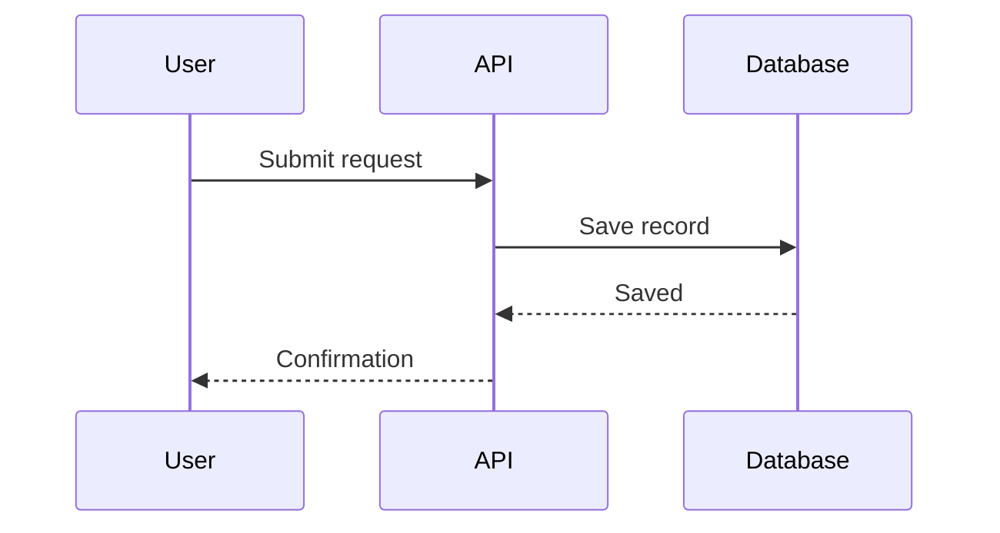

# Architecture diagram

Read source material for actors, system/container responsibilities, datastores, boundaries and known protocols. Distinguish existing architecture from a proposed design. Do not fill gaps with invented technologies; mark necessary assumptions.

Choose one abstraction level per view. Use a flowchart with subgraphs for C4-style context/container structure, or `sequenceDiagram` for ordered messages. Mermaid flowcharts approximate C4 notation; do not claim formal C4 syntax or model validation.

Label meaningful relationships with their purpose and known protocol. Keep trust, deployment and system boundaries distinct. Add technology labels only when supported. Style roles consistently without making color the only distinction; split deep internals into another view.

Write source directly using `artifacts_create` to `/architecture.mmd`; the preview renders it natively.

For flowcharts, use stable IDs, quote labels containing punctuation and use ` ` only for intentional breaks. In sequence messages/notes, use plain words instead of HTML entities or angle-bracket comparisons; keep conditional/loop nesting readable.

Fix parser errors reported by the file tool. Check arrows against actual callers and data ownership, and include relevant failures or async behavior when the source describes them. Deliver the diagram with consequential unknowns or assumptions.
