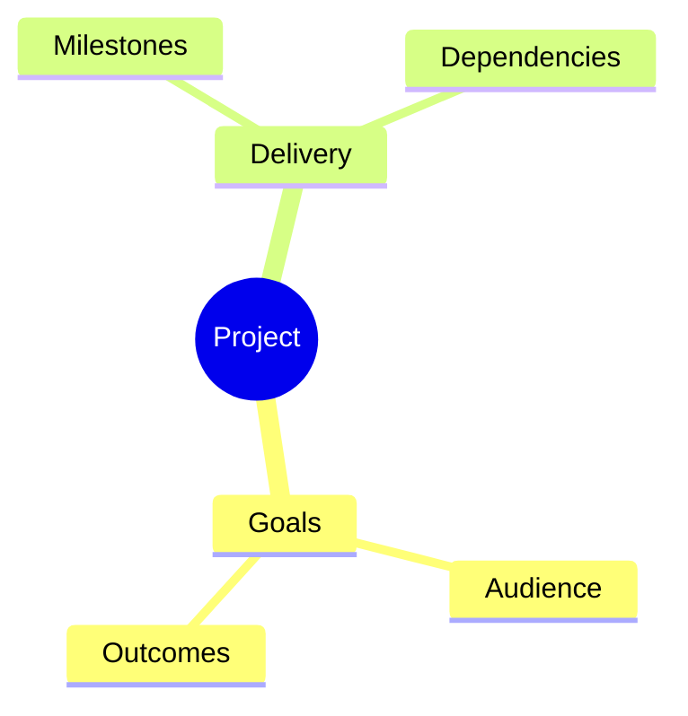

# Mind map

Read the material, identify a central theme and group related concepts by meaning. Preserve the source hierarchy; choose branch counts and depth from the content. Do not invent facts to make branches symmetrical.

Use concise labels with enough context to distinguish siblings. If cross-links are essential, use an appropriate graph instead of forcing a tree.

Indentation defines Mermaid mind-map hierarchy. Keep it consistent and avoid unescaped syntax in labels. Save source directly with `artifacts_create` as `/mindmap.mmd`; the preview renders it natively. Fix parser errors reported by the file tool.

Check that no important source branch vanished during compression. Deliver the file and identify any grouping that is your interpretation.
