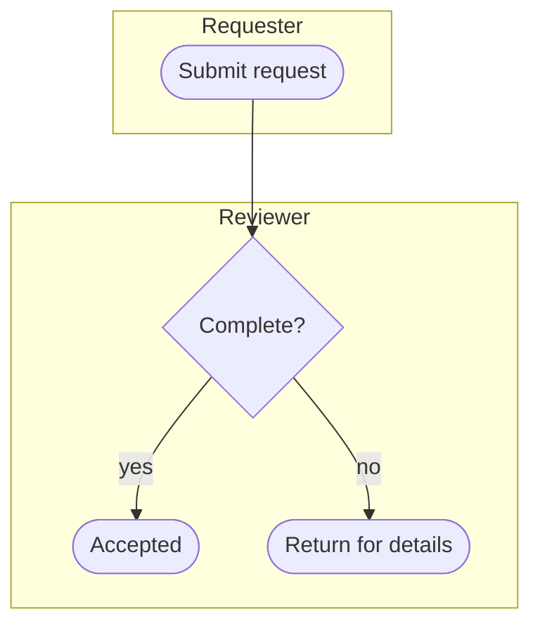

# Process diagram

Extract the actual triggers, roles, actions, decision criteria, approvals, handoffs and outcomes. Preserve the distinction between the current process and proposed improvements. Include documented controls; do not invent regulatory obligations or approval steps.

Use a Mermaid flowchart; subgraphs can approximate role/system swimlanes. This is a BPMN-style illustration, not an executable or formally validated BPMN model. Follow an explicitly requested framework where representable.

- Name tasks with an actor's action and place each in the responsible lane.
- Label decision branches with outcomes/criteria and preserve all meaningful alternatives.
- Show the triggers and end states the process actually has; do not force one start.
- Make handoffs, rejection paths and retries explicit when supported.
- Separate large subflows rather than compressing labels beyond recognition.
- Mark unknowns and proposed steps; never present them as documented facts.

Save source directly with `artifacts_create` as `/process.mmd`. Use stable IDs and quote punctuation-bearing labels. Prefer words over angle-bracket comparisons; use ` ` only for intentional breaks. Fix parser errors reported by the file tool.

Trace each route from trigger to outcome. Check for unintended dead ends, missing decision branches and incorrect ownership. Hand off the file and any assumptions requiring process-owner review.
