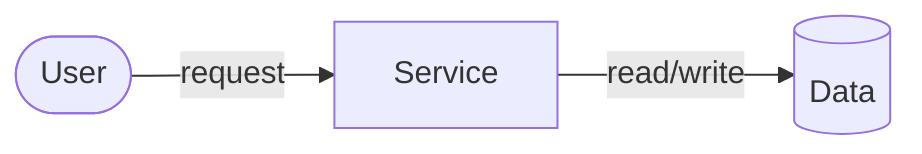

# Visualize

Choose the form that exposes the relationship: Mermaid for flows, sequences, schemas and trees; authored SVG for spatial mechanisms; HTML with SVG/canvas and controls when changing a parameter helps understanding. A mechanism drawing should show the actual parts and forces, not replace them with generic process boxes. Split a dense topic into focused views.

Ground labels and relationships in the supplied material. Label illustrative numbers and assumptions; use `data-visualization` for measured datasets. Keep explanation close to the relevant visual and omit decorative complexity.

## Mermaid

Save source directly with `artifacts_create` as `/diagram.mmd`; previews render it natively. Use stable node IDs and concise labels. Quote flowchart labels containing punctuation; use ` ` only for intentional breaks. In sequence messages/notes, prefer plain words over HTML entities or angle-bracket comparisons. Keep `alt`/`opt`/`loop` nesting readable.

Use semantic colors when they help distinguish roles. Fix file-tool parse errors before delivery.

## SVG and HTML

Set a responsive viewBox with room for all labels and arrowheads. Connector paths need `fill="none"`. SVG text does not wrap: measure labels or use positioned `tspan` lines. Reuse markers and style tokens.

For an interactive explainer, connect each control to a visible consequence and label units, initial conditions and assumptions. Use `html-artifacts` for bundled libraries, SDK services or export constraints. Native HTML/SVG/JavaScript can make a standalone explainer without dependencies. Persist state only when it benefits the task.

Verify labels, geometry and model behavior at meaningful parameter values; identify approximations. Save the visual in the requested format and give a brief handoff.
